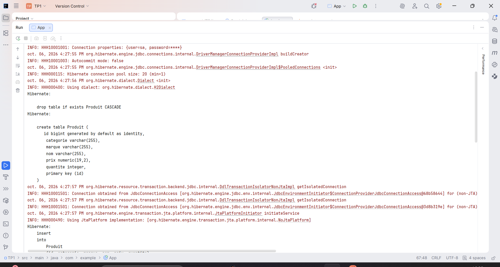
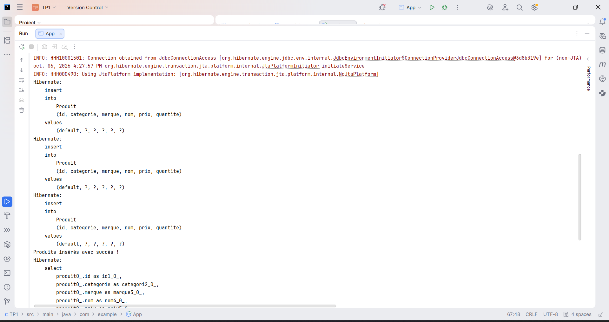
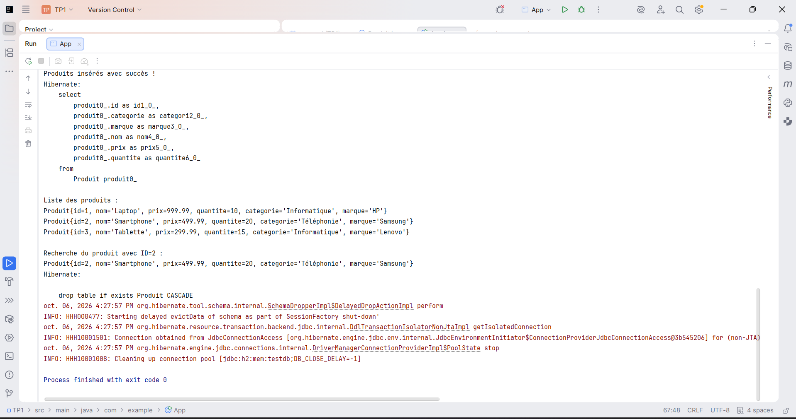
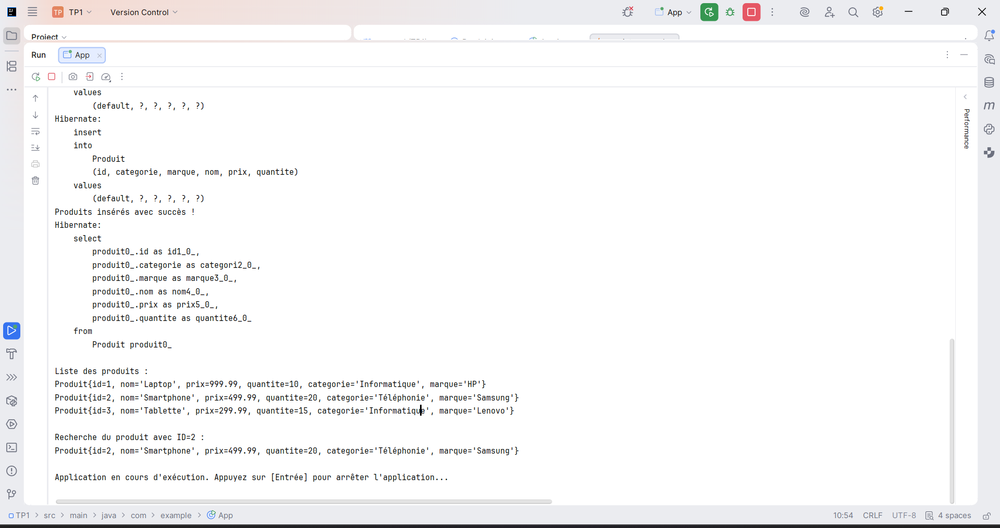
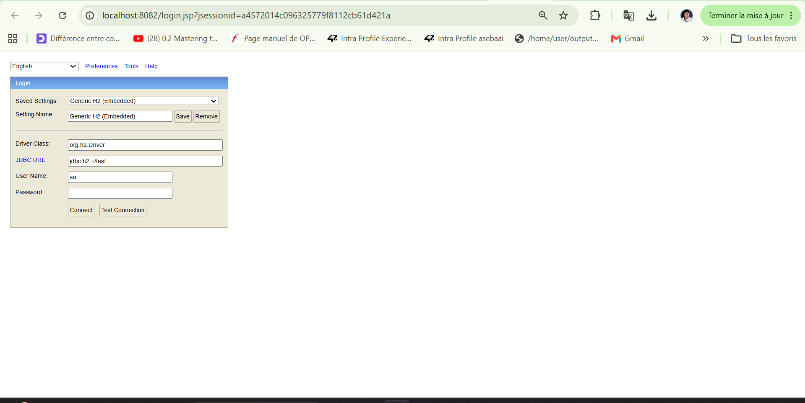
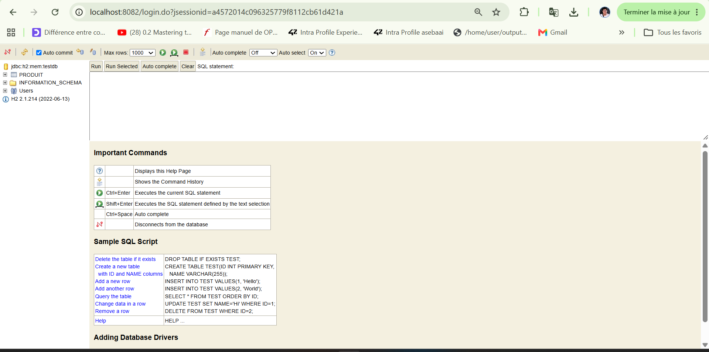

# TP1 - Résultats d'exécution et Visualisation H2

Voici les captures d'écran démontrant l'exécution du projet, les opérations Hibernate/JPA ainsi que l'accès à la console Web H2.

---

### 1. Démarrage Hibernate et Création de la table `Produit`

---

### 2. Insertion des entités Produit dans la base de données

---

### 3. Requêtes JPQL et Affichage des résultats

---

### 4. Exécution de l'application avec maintien de la session

---

### 5. Connexion à la Console Web H2 (`http://localhost:8082`)

---

### 6. Visualisation de la table `PRODUIT` dans l'interface H2

